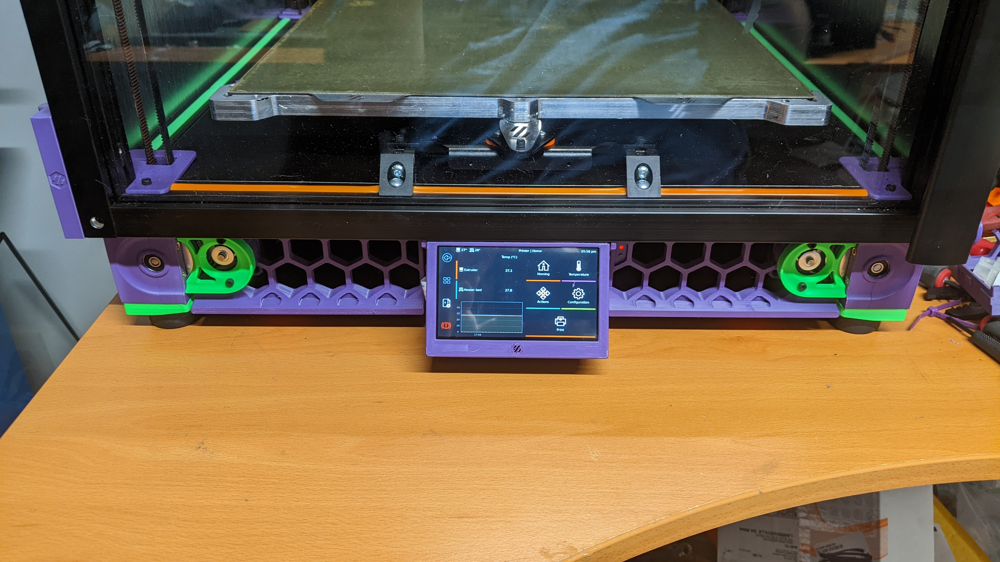

# Extended Voron 2.4 Waveshare 4.3" DSI LCD Mount

This is a modified version of the Waveshare 4.3" LCD mount by [jeoje](https://github.com/jeoje), the original is found here in [VoronUsers](https://github.com/jeoje/VoronUsers/tree/master/printer_mods/jeoje/4.3_Inch_Touchscreen_Mount).

This version is extended forward by 20mm to clear a door-panel frame made of 2020 extrusions.

Other small modifications for better fit with the Waveshare 4.3" panel.

## Files

[CAD](/CAD/)

[STL](/STL/)

